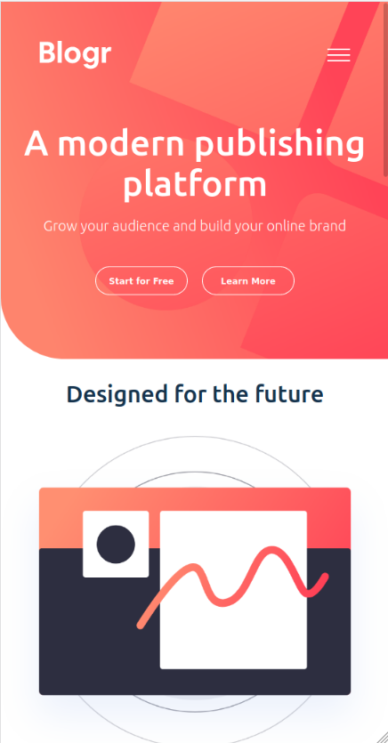
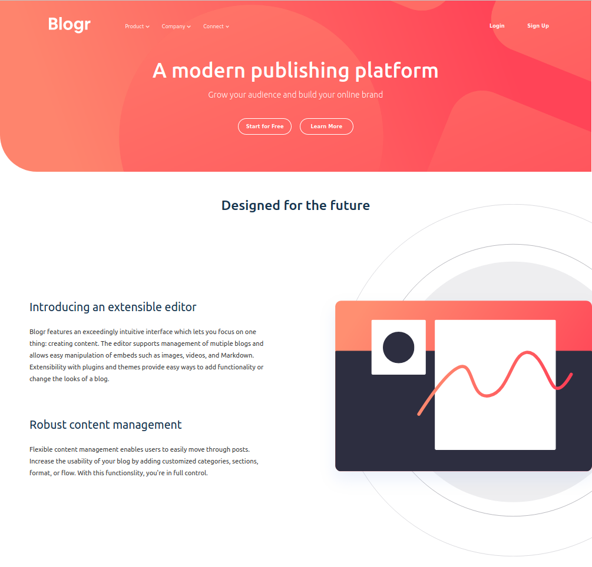

# Frontend Mentor - Blogr landing page solution

This is a solution to the [Blogr landing page challenge on Frontend Mentor](https://www.frontendmentor.io/challenges/blogr-landing-page-EX2RLAApP). Frontend Mentor challenges help you improve your coding skills by building realistic projects. 
### The challenge

Users should be able to:

- View the optimal layout for the site depending on their device's screen size
- See hover states for all interactive elements on the page

### Screenshot

 

### Links

- Solution URL: [GitHub Repository](https://github.com/fl4viooliveira/blogr_landing_page)
- Live Site URL: [GitHub Page](https://fl4viooliveira.github.io/blogr_landing_page/)

## My process

### Built with

- Semantic HTML5 markup
- CSS custom properties
- Flexbox
- CSS Grid
- [Svelte](https://svelte.dev/) - Svelte

### Useful resources

- [A Complete Guide to Flexbox](https://css-tricks.com/snippets/css/a-guide-to-flexbox/) 
- [A Complete Guide to Grid ](https://css-tricks.com/snippets/css/complete-guide-grid/)
## Author

- Website - [Flavio Oliveira](https://fl4viooliveira.github.io/)
- Frontend Mentor - [@fl4viooliveira](https://www.frontendmentor.io/profile/fl4viooliveira)
- Twitter - [@fl4viooliveira](https://twitter.com/fl4viooliveira)
